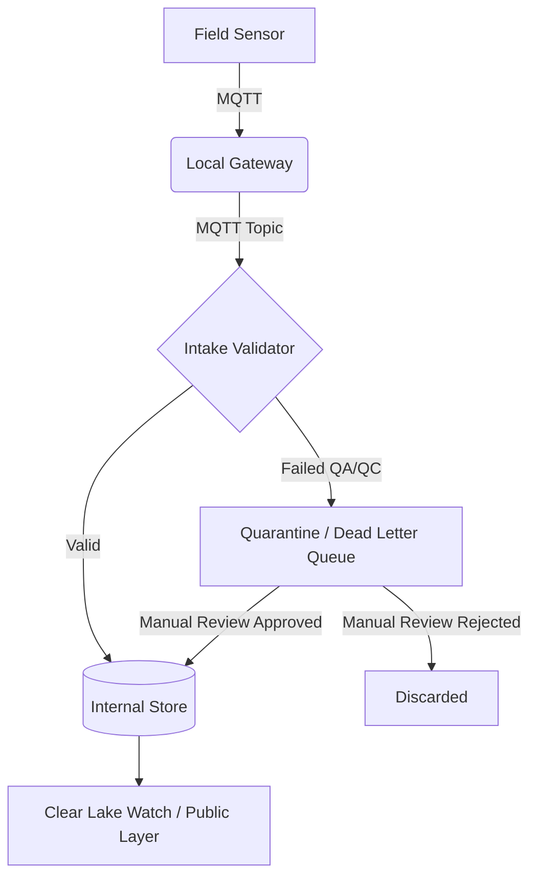

# Architecture Sketch

This diagram outlines the high-level data flow for the Community Environmental Monitoring Platform, illustrating how field data moves from sensors to Clear Lake Watch.

## Description
1. **Field Sensor**: Captures environmental readings in the field.
2. **Local Gateway**: Receives local signals (e.g., LoRaWAN) and translates them to MQTT.
3. **Intake Validator**: Reads from MQTT topics and checks payloads against the Sensor Data Contract and basic QA/QC rules.
4. **Internal Store**: Holds valid, trustworthy data that is ready for consumption.
5. **Quarantine / Dead Letter Queue**: Holds malformed or suspect readings that require human review or engineering diagnostics.
6. **Clear Lake Watch**: The public-facing dashboard consumes only validated and approved data from the internal store.
